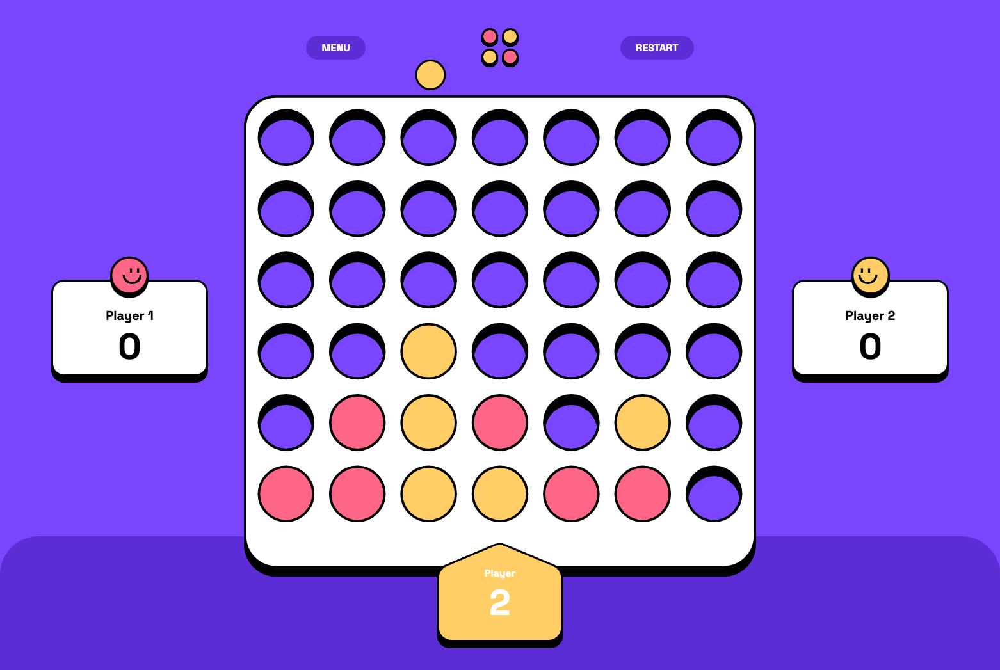

# Connect Four

Connect Four is a local 1v1 game. The goal is to connect 4 dots faster than your opponent, either horizontally, vertically or diagonally.



## Demo

You can try out the game at [https://connect-four-danielkrux.vercel.app/](https://connect-four-danielkrux.vercel.app/). Have fun! 🎮

## Running the game yourself

Run the following commands after cloning this repository:

```bash
npm i
npm run dev
```

Open [http://localhost:3000](http://localhost:3000) with your browser to see the result.

## Tech talk

The game is made with [NextJS](https://nextjs.org/docs)'s new app router approach. Most of the components are Server Components and the state is kept in cookies. Whenever you click a column a server action updates the state cookie and the game updates itself.

The styling is done with [TailwindCSS](https://tailwindcss.com/docs).
